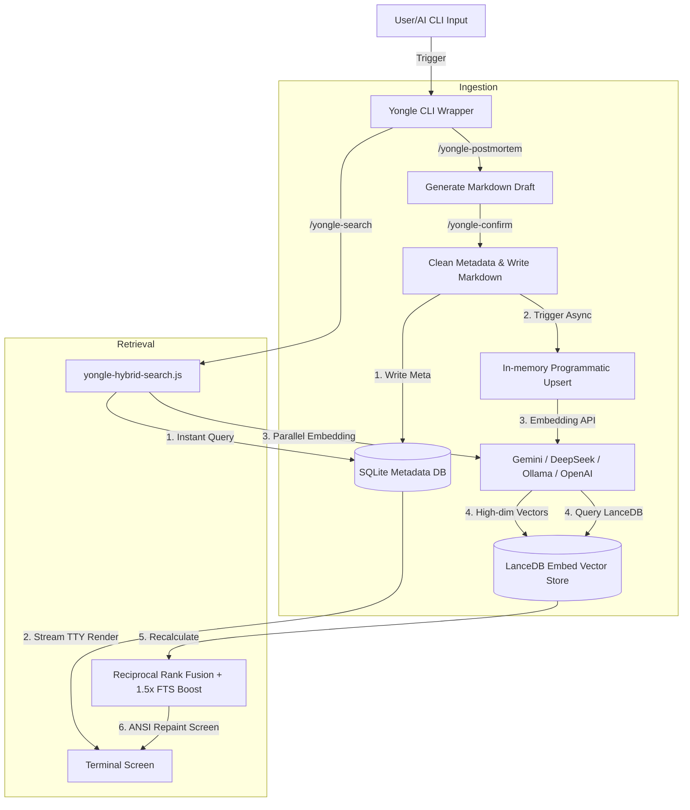

# 永乐大典 (Yongle Dadian) — AI Agent Long-term Memory & Hybrid Search Engine

[🇨🇳 中文版](#-yongle-dadian--ai-agent-%E9%95%BF%E6%9C%9F%E8%AE%B0%E5%BF%86%E4%B8%8E%E6%B7%B7%E5%90%88%E6%A3%80%E7%B4%A2%E5%BC%95%E6%93%8E) | [🇬🇧 English Version](#-yongle-dadian--ai-agent-long-term-memory--hybrid-search-engine)

---

## 🇨🇳 永乐大典 — AI Agent 长期记忆与混合检索引擎

> **“知识就是力量，但只有能被迅速找回的知识才是生产力。”**

在人类开发者与 AI Agent（如 Antigravity, Claude Code, Gemini CLI, Cursor, Trae 等）进行结对编程（Pair Programming）的过程中，最常见的痛点是：
1. **重复踩坑**：相同的 Bug、环境配置问题、甚至代码库的设计局限性，在多次 Reset 会话或开启新对话后被 AI 一犯再犯。
2. **上下文流失**：长对话中沉淀下来的“完美解决方案”和“关键决策（Key Decisions）”随着会话归档或 Token 限制而丢失，无法跨越会话继承。
3. **传统的检索无能**：基于简单的关键词搜索（Grepping/FTS5）很容易因为语义表达不同（如输入“乱码”却搜不到带有“encoding”的笔记）而完美错过正确经验。

**永乐大典**正是为了解决这一痛点而生的**本地优先（Local-First）、AI 伴生的长期记忆与检索引擎**。它能够将 AI 的调试历程与解决方案自动凝练成标准化 Markdown 经验，并通过**“SQLite 全文检索 + LanceDB 本地向量语义检索”双引擎**与 RRF 算法进行融合排序，实现毫秒级、强语义相关的知识召回，彻底终结 AI 的“健忘症”。

---

### 🗺️ 目录

- [🇨🇳 永乐大典 — AI Agent 长期记忆与混合检索引擎](#-yongle-dadian--ai-agent-长期记忆与混合检索引擎)
  - [🗺️ 目录](#️-目录)
  - [1. 核心价值与应用场景](#1-核心价值与应用场景)
  - [2. 技术栈与系统架构](#2-技术栈与系统架构)
  - [3. 安装与配置说明](#3-安装与配置说明)
  - [4. 快速上手指南](#4-快速上手指南)
  - [5. 详细命令手册](#5-详细命令手册)
  - [6. 与交付框架 GSD (Get Shit Done) 协同工作](#6-与交付框架-gsd-get-shit-done-协同工作)
- [🇬🇧 Yongle Dadian — AI Agent Long-term Memory & Hybrid Search Engine](#-yongle-dadian--ai-agent-long-term-memory--hybrid-search-engine-1)
  - [🗺️ Table of Contents](#️-table-of-contents)
  - [1. Core Value & Scenarios](#1-core-value--scenarios)
  - [2. Tech Stack & Architecture](#2-tech-stack--architecture)
  - [3. Installation & Configuration](#3-installation--configuration)
  - [4. Quick Start](#4-quick-start)
  - [5. Command Details](#5-command-details)
  - [6. Synergy with Harness Framework GSD (Get Shit Done)](#6-synergy-with-harness-framework-gsd-get-shit-done)

---

### 1. 核心价值与应用场景

#### 💡 为什么有这个项目？
人类开发者的精力和记忆是有限的，而 AI 代理在会话切换后的记忆甚至是“零”。永乐大典通过一套非阻塞的、AI 自主驱动的复盘和搜索流水线，在开发流程的后台自动捕获错误，生成带有标准 Frontmatter 元数据的高质量经验库，并对每一次新检索提供最强力的语义检索支持。

#### 🎯 典型应用场景
- **AI 自动复盘**：当开发过程中遭遇严重的 Bug，AI 调试成功后，直接触发复盘。AI 会自动识别刚才的尝试和痛点，写成标准化草稿。
- **混合高准确度召回**：输入模糊的意图描述，系统即刻在 0.1 秒内流式输出 SQLite 倒排匹配，并在后台并行提取向量，在 LanceDB 语义空间进行匹配，最终使用 RRF 算法将两者交融，提供最佳匹配。
- **跨平台一致性**：无论你在 Windows（Powershell/CMD）、macOS 还是 Linux 下，整个套件均表现出完美的命令行长度溢出兼容与无阻塞多线程体验。

---

### 2. 技术栈与系统架构

永乐大典采用**完全去中心化、无服务器依赖（Serverless / Local-first）**的极致精简架构。

#### 🛠️ 技术栈
- **核心逻辑**：Node.js（>= 18.0.0）。
- **全文检索**：SQLite3 本地关系型数据库（Metadata & Fast FTS）。
- **向量数据库**：LanceDB（利用 `vectordb` 驱动实现高性能内嵌式向量存储）。
- **Embedding 引擎**：支持全模型自适应。内置对 **Gemini (gemini-embedding-001)**, **DeepSeek**, **Ollama (nomic-embed-text)**, **OpenAI (text-embedding-3-small)** 以及任何 **OpenAI-Compatible** 自定义端点（vLLM, OpenRouter, LiteLLM 等）的开箱即用支持。
- **同步引擎**：基于 Git/GitHub 的自动增量同步与多机冲突合并逻辑。

#### 🏗️ 架构设计图
```mermaid
graph TD
    UserInput[用户或AI命令行输入] -->|Trigger| CLI[Yongle CLI Wrapper]
    
    subgraph 自动复盘与存储 (Ingestion)
        CLI -->|/yongle-postmortem| Draft[生成 Markdown 草稿]
        Draft -->|/yongle-confirm| Clean[元数据清洗 & 写入物理 Markdown]
        Clean -->|1. 数据库写入| SQLite[(SQLite Metadata DB)]
        Clean -->|2. 异步触发| ProgrammaticUpsert[内存级程序化 Upsert]
        ProgrammaticUpsert -->|3. Embedding API| Models[Gemini / DeepSeek / Ollama / OpenAI]
        Models -->|4. 高维特征返回| LanceDB[(LanceDB Embed Vector Store)]
    end

    subgraph 混合召回与融合 (Retrieval)
        CLI -->|/yongle-search| HybridSearcher[yongle-hybrid-search.js]
        HybridSearcher -->|1. 瞬时查询| SQLite
        SQLite -->|2. TTY流式渲染打底| Term[终端展示]
        HybridSearcher -->|3. 并发 Embedding 提取| Models
        Models -->|4. 语义向量匹配| LanceDB
        LanceDB -->|5. 结果重汇聚| RRF[Reciprocal Rank Fusion 融合算法 + 1.5x FTS 提权]
        RRF -->|6. 光标退回重绘| Term
    end
```

---

### 3. 安装与配置说明

提供两种安装与配置途径：

#### 📦 途径 A：通过 npm 全局安装（推荐）
```powershell
npx yongle-dadian --global --antigravity
```
*这会自动将永乐大典注册到你的系统环境变量及宿主 Agent 工作流中。*

#### 🔧 途径 B：本地源码安装（适合定制开发）
1. 克隆仓库：
   ```powershell
   git clone https://github.com/Lemony/yongle-dadian.git
   cd yongle-dadian
   ```
2. 安装依赖：
   ```powershell
   npm install
   ```
3. 注册到全局：
   ```powershell
   node bin/install.js --global --antigravity
   ```

#### 🔄 如何更新

更新永乐大典非常简单，它与你的安装途径一一对应：

- **途径 A（npm 全局）**：直接再次运行 `npx` 即可拉取最新版：
  ```powershell
  npx yongle-dadian --global --antigravity
  ```
- **途径 B（源码克隆）**：拉取最新代码并重新运行安装器：
  ```powershell
  git pull
  npm install
  node bin/install.js --global --antigravity
  ```

#### 🗑️ 如何卸载

如果你需要完全移除永乐大典及其技能插件：

1. **卸载技能插件**：运行安装器的 `--uninstall` 标志，从宿主 Agent 中移除技能绑定：
   ```powershell
   node bin/install.js --uninstall --global --antigravity
   ```
2. **（可选）清理本地知识库**：若你想彻底销毁已沉淀的本地数据库和 Markdown 条目（数据无法找回，请谨慎操作）：
   ```powershell
   # Windows PowerShell
   Remove-Item -Path "$HOME\.yongle_knowledge" -Recurse -Force
   
   # macOS / Linux Bash
   rm -rf ~/.yongle_knowledge
   ```

#### ⚙️ 配置文件说明 (`~/.yongle_knowledge/config.json`)
永乐大典在初始化时会在用户家目录下生成 `.yongle_knowledge` 目录。你可以通过修改其中的 `config.json` 来配置首选的 Embedding 提供商：

##### 配置 Gemini (推荐)
```json
{
    "embedding": {
        "provider": "gemini",
        "model": "gemini-embedding-001",
        "apiKey": "YOUR_GEMINI_API_KEY"
    }
}
```

##### 配置 DeepSeek
```json
{
    "embedding": {
        "provider": "deepseek",
        "model": "deepseek-embedding",
        "apiKey": "YOUR_DEEPSEEK_API_KEY"
    }
}
```

##### 配置 Ollama (本地私有化)
```json
{
    "embedding": {
        "provider": "ollama",
        "model": "nomic-embed-text",
        "baseUrl": "http://localhost:11434"
    }
}
```

---

### 4. 快速上手指南

只需三步，即可让 AI 记住并检索你的全部开发经验：

1. **第一步：回填历史存量文档（Backfill）**
   如果你已经有一些存量 Markdown 文件，运行以下命令让系统生成向量并灌库：
   ```powershell
   npm run embed:all
   ```

2. **第二步：遇到 Bug 解决后，一键复盘**
   在 AI 帮你修复了一个编码或乱码问题后，对它输入：
   ```markdown
   @[/yongle-postmortem]
   ```
   AI 将自动捕获整个调试周期（包括你失败的尝试和最终成功方案），并在终端输出预览。选择 `✅ 确认并正式归档`，它将被安全地写入物理 Markdown 并瞬间生成向量和 SQLite 倒排索引。

3. **第三步：智能检索**
   在全新的会话中，模糊检索你的意图：
   ```powershell
   node scripts/yongle-hybrid-search.js global "怎么搞定乱码问题"
   ```
   或者直接限制纯语义搜索（不依赖特定关键词匹配）：
   ```powershell
   node scripts/yongle-hybrid-search.js global "搞定乱码" --semantic-only
   ```

---

### 5. 详细命令手册

| 命令 / 脚本 | 主要参数 | 功能详述 |
|-------------|----------|----------|
| `/yongle-postmortem` | `--global` / `--local` | **事后自动复盘**。向上回溯当前会话的上下文，智能识别第一报错信息、失败的尝试路径、最终正确代码、防复发建议，生成标准化元数据的 Markdown 草稿。 |
| `/yongle-confirm` | `<draft-path>` | **升级草稿归档**。移除草稿标记，写入物理索引 `INDEX.md`，并在 SQLite 写入条目，同时非阻塞式派生后台异步向量化进程。 |
| `scripts/yongle-hybrid-search.js` | `<scope> <query> [--semantic-only]` | **混合检索器**。在 TTY 终端下启动流式更新：即刻打印 SQLite FTS 匹配 -> 后台并发获取 Embedding 并计算 LanceDB 语义相似度 -> RRF 融合计算并擦除终端，重绘终榜结果。 |
| `/yongle-tag` | 无 | **过程探针**。在当前会话中置入一个“眼”（Active Watch），持续记录调试步骤，提供给后期复盘时最高优先级的上下文。 |
| `/yongle-recall` | 无 | **记忆召回**。秒级搜索已沉淀的项目风格决策、架构建议等全局/局部思维模式（Thoughts/Styles）。 |
| `/yongle-reindex` | 无 | **重建 SQLite**。全量重新扫描指定 scope 的 Markdown 目录并无损重建 SQLite 主库的 Entries 关联。 |
| `npm run embed:all` | 无 | **并发向量灌库**。以最多 5 的并发连接池安全、快速地把所有存量文件进行 Semantic Chunking 分块，并通过防 ENAMETOOLONG 的内存模块方式录入 LanceDB。 |
| `/yongle-sync` | 无 | **增量云同步**。在后台非阻塞式将本地库推送到绑定的 GitHub 团队/个人仓库。 |

---

### 6. 与交付框架 GSD (Get Shit Done) 协同工作

永乐大典与 AI 交付框架 **Get Shit Done (GSD)** 构成了完美的结对编程闭环关系：

- **GSD**：是一个专注于“短期交付与过程控制”的结构化 CLI 框架。它定义了开发流程的规范（SPECs、PLANs、CHECKLISTs、TESTs），保证 AI **“把事情做完” (Get Shit Done)**。
- **永乐大典**：是一个专注于“长期记忆与防踩坑”的检索库。它沉淀了所有的开发事故和最佳架构设计，保证 AI **“不会让烂事再次发生” (Prevent Shit Happening Again)**。

#### 🔗 GitHub 协同项目
- [Get Shit Done (GSD) Harness Framework](https://github.com/Lemony/get-shit-done) (提供精密的 AI 阶段规范管控、Nyquist 验证审计与自动化测试流)。

---

## 🇬🇧 Yongle Dadian — AI Agent Long-term Memory & Hybrid Search Engine

> **"Knowledge is power, but only knowledge that can be quickly retrieved is productivity."**

When human developers pair-program with AI Agents (such as Antigravity, Claude Code, Gemini CLI, Cursor, Trae, etc.), the most common pain points are:
1. **Repeating Bugs**: The same environment configurations, API quirks, or codebase design limits are repeatedly forgotten and re-violated by AI whenever a session is reset or a new chat begins.
2. **Context Loss**: Great solutions and key decisions synthesized during long sessions are eventually lost due to archival or context token window limits, never inherited across chats.
3. **Keyword-search Inefficiency**: Traditional FTS (Full-Text Search) fails to return relevant matches when the semantic expression differs (e.g., searching for "encoding issue" misses a document containing only "garbled characters").

**Yongle Dadian** is a **local-first, AI-companion long-term memory and retrieval engine** specifically built to solve these exact problems. It automatically structures the AI's debugging history and final code solutions into standardized Markdown documents, indexing them via a **"SQLite FTS + LanceDB Embedded Vector Database" dual-engine** merged by the Reciprocal Rank Fusion (RRF) algorithm to achieve millisecond-level semantic recall.

---

### 🗺️ Table of Contents

- [1. Core Value & Scenarios](#1-core-value--scenarios)
- [2. Tech Stack & Architecture](#2-tech-stack--architecture)
- [3. Installation & Configuration](#3-installation--configuration)
- [4. Quick Start](#4-quick-start)
- [5. Command Details](#5-command-details)
- [6. Synergy with Harness Framework GSD (Get Shit Done)](#6-synergy-with-harness-framework-gsd-get-shit-done)

---

### 1. Core Value & Scenarios

#### 💡 Why This Project?
Human developers have finite memories, and AI agents have "zero memory" across session resets. Yongle Dadian uses a non-blocking, AI-driven postmortem extraction pipeline to capture errors in the background, compile them into rich Markdown entries with standardized YAML metadata, and supply future queries with highly accurate hybrid semantic results.

#### 🎯 Ideal Scenarios
- **Automated Postmortem**: When a critical bug is solved, trigger a postmortem. The AI summarizes what failed, what was attempted, and what succeeded into a standardized draft.
- **Hybrid Search**: Query a concept, and get instant SQLite matches, followed by a background semantic matching in LanceDB, merged together instantly via RRF.
- **Cross-Platform Safety**: Provides maximum compatibility with Windows (bypassing CMD 8191 command-line length limits programmatically) and handles non-TTY environments cleanly.

---

### 2. Tech Stack & Architecture

Yongle Dadian features a **decentralized, local-first, serverless** design.

#### 🛠️ Tech Stack
- **Core Engine**: Node.js (>= 18.0.0).
- **Relational FTS**: SQLite3 local database (for metadata and instant queries).
- **Vector Storage**: LanceDB (embedded engine via `vectordb` package, no extra system server required).
- **Embedding Adapters**: Auto-adapts to major models including **Gemini (gemini-embedding-001)**, **DeepSeek**, **Ollama (nomic-embed-text)**, **OpenAI (text-embedding-3-small)**, and any **OpenAI-Compatible** endpoints.
- **Sync System**: Git-based secure hybrid merging for cloud syncing.

#### 🏗️ Architecture Flow


---

### 3. Installation & Configuration

Two installation pathways are supported:

#### 📦 Approach A: Global CLI Installation via npm (Recommended)
```powershell
npx yongle-dadian --global --antigravity
```
*This registers all workflows and environments to your system globally.*

#### 🔧 Approach B: Local Source Installation (For Custom Hacking)
1. Clone the repository:
   ```powershell
   git clone https://github.com/Lemony/yongle-dadian.git
   cd yongle-dadian
   ```
2. Install npm dependencies:
   ```powershell
   npm install
   ```
3. Link globally:
   ```powershell
   node bin/install.js --global --antigravity
   ```

#### ⚙️ Configuration File (`~/.yongle_knowledge/config.json`)
Customize your preferred embedding engine in the configuration file generated in your home directory:

##### Config Gemini (Recommended)
```json
{
    "embedding": {
        "provider": "gemini",
        "model": "gemini-embedding-001",
        "apiKey": "YOUR_GEMINI_API_KEY"
    }
}
```

##### Config DeepSeek
```json
{
    "embedding": {
        "provider": "deepseek",
        "model": "deepseek-embedding",
        "apiKey": "YOUR_DEEPSEEK_API_KEY"
    }
}
```

##### Config Ollama (Self-hosted Local)
```json
{
    "embedding": {
        "provider": "ollama",
        "model": "nomic-embed-text",
        "baseUrl": "http://localhost:11434"
    }
}
```

#### 🔄 How to Update

Updating Yongle Dadian is as simple as re-running the installation steps:

- **Approach A (npm Global)**: Just run the `npx` command again to fetch and link the latest version:
  ```powershell
  npx yongle-dadian --global --antigravity
  ```
- **Approach B (Source Clone)**: Pull latest git changes and re-run installer:
  ```powershell
  git pull
  npm install
  node bin/install.js --global --antigravity
  ```

#### 🗑️ How to Uninstall

To cleanly remove all yongle integration and files:

1. **Uninstall Agent Skills**: Use the `--uninstall` flag in the installer to unbind skills from the host Agent:
   ```powershell
   node bin/install.js --uninstall --global --antigravity
   ```
2. **(Optional) Wipe Knowledge Base**: If you want to permanently erase the local databases and Markdown notes (Caution: this is irreversible!):
   ```powershell
   # Windows PowerShell
   Remove-Item -Path "$HOME\.yongle_knowledge" -Recurse -Force
   
   # macOS / Linux Bash
   rm -rf ~/.yongle_knowledge
   ```

---

### 4. Quick Start

Three steps to run semantic search in your daily coding workflows:

1. **Step 1: Backfill Existing Markdown Notes**
   If you have old markdown notes in your repository, run the batch script to generate vectors:
   ```powershell
   npm run embed:all
   ```

2. **Step 2: Archive an AI Debugging Experience**
   Once a bug is solved, type:
   ```markdown
   @[/yongle-postmortem]
   ```
   The AI reviews the chat context and structures a markdown postmortem draft. Choose `✅ Confirm and Archive` to save and auto-index the entry.

3. **Step 3: Perform Hybrid Query**
   Run the search script:
   ```powershell
   node scripts/yongle-hybrid-search.js global "how to solve character encoding bugs"
   ```
   Or restrict queries to vector semantic-only (bypassing exact keyword matches):
   ```powershell
   node scripts/yongle-hybrid-search.js global "char coding bugs" --semantic-only
   ```

---

### 5. Command Details

| Command / Script | Arguments | Description |
|------------------|-----------|-------------|
| `/yongle-postmortem` | `--global` / `--local` | **Context Postmortem Analyzer**. Scans active conversation context, extracts root causes, debug paths, and resolutions, generating a rich metadata markdown draft. |
| `/yongle-confirm` | `<draft-path>` | **Draft Archiver**. Upgrades a draft to a final postmortem entry, registers metadata in SQLite, and asynchronously kicks off background vector processing. |
| `scripts/yongle-hybrid-search.js` | `<scope> <query> [--semantic-only]` | **Hybrid Searcher CLI**. Prints SQLite results instantly on TTY, performs vector embeddings in the background, fuses them via RRF with 1.5x FTS Boost, and redraws the final list using ANSI screen controls. |
| `/yongle-tag` | None | **Process Tracker Probe**. Seeds an active debugger checkpoint in the chat context to capture step-by-step logic, prior to postmortem synthesis. |
| `/yongle-recall` | None | **Mind Recall**. Instantly searches structured styles, architecture plans, and thinking patterns (Thoughts/Styles). |
| `/yongle-reindex` | None | **Reindex Database**. Rescans specified markdown directories to reconstruct a fresh SQLite main database schema. |
| `npm run embed:all` | None | **Batch Vector Backfiller**. Implements concurrent processing (pool size 5) with custom memory-upsert wrappers to bypass Windows shell length limits. |
| `/yongle-sync` | None | **Sync Cloud Push**. Merges local memory stores to a target GitHub repository in the background. |

---

### 6. Synergy with Harness Framework GSD (Get Shit Done)

Yongle Dadian and the AI engineering delivery harness **Get Shit Done (GSD)** form the ultimate pair-programming cycle:

- **GSD**: A structured CLI framework focused on "short-term delivery and quality control". It structures phases (Specs, Plans, Checklists, Tests) ensuring the AI **"Gets Shit Done"**.
- **Yongle Dadian**: A search and memory engine focused on "long-term memory and bug prevention". It acts as the brain, ensuring the AI **"Prevents Shit Happening Again"**.

#### 🔗 GitHub Harness Repository
- [Get Shit Done (GSD) Harness Framework](https://github.com/Lemony/get-shit-done) (Providing rigorous AI phase governance, Nyquist audits, and automated verification loops).

---

*Copyright © 2026 Lemony. Licensed under the MIT License.*
